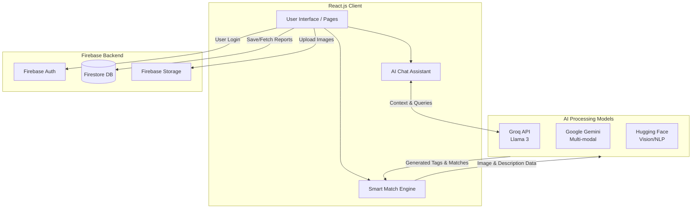

# 🔍 FindIt AI

<p align="center">
  <strong>An Intelligent, AI-Powered Lost & Found Platform</strong>
</p>

## 📖 What is FindIt AI?

FindIt AI is a modern web application designed to revolutionize the way people report and recover lost items. Leveraging cutting-edge Artificial Intelligence, the platform goes beyond traditional keyword searches. By utilizing computer vision, natural language processing, and smart tagging, FindIt AI can automatically match "Found" items with "Lost" reports based on visual similarity and semantic context, drastically reducing the time it takes to reunite owners with their belongings.

## 🎯 Use Cases

- **College Campuses & Universities**: Students can quickly report lost IDs, laptops, or backpacks, while campus security can easily log found items and let the AI automatically find the matches.
- **Airports & Transit Hubs**: Handle high volumes of lost luggage and personal items efficiently with smart image-based matching.
- **Public Events & Festivals**: Provide a rapid response platform for attendees to locate dropped phones, keys, or wallets during large gatherings.
- **Corporate Offices**: Manage building lost & found inventories with an intelligent, automated digital ledger.

## ✨ Key Features

- **🧠 AI-Powered Smart Matching**: Uses advanced Large Language Models (LLMs) and Vision models to analyze item descriptions and images, automatically finding matches even if the exact wording differs (e.g., "Navy Blue Rucksack" matches "Dark Blue Backpack").
- **📸 Visual Recognition**: Upload an image of a found item, and the AI will auto-generate smart tags and detailed descriptions to categorize it perfectly.
- **💬 AI Chat Assistant**: An integrated intelligent chatbot to help users navigate the app, report items, or check the status of their lost belongings in plain English.
- **⚡ Real-Time Data**: Built on Firebase to ensure that the moment an item is reported, it is instantly searchable and visible to the community.
- **🎨 Premium UI/UX**: A highly responsive, accessible, and beautiful interface featuring modern design principles, dynamic animations, and dark mode support.

## 🏗️ System Architecture



## 📸 Output Screenshots

*(Note to developer: Replace the placeholder image links below with the actual paths to your screenshots, e.g., `./public/screenshot1.png`)*

| Home Page | Report an Item |
| :---: | :---: |
|  |  |

| AI Smart Matching Results | AI Chat Assistant |
| :---: | :---: |
|  |  |

## 🛠️ Tech Stack

**Frontend Framework & Styling:**
- [React.js](https://reactjs.org/) (Powered by [Vite](https://vitejs.dev/))
- [Tailwind CSS](https://tailwindcss.com/)
- [Framer Motion](https://www.framer.com/motion/) (Animations)

**Backend & Database:**
- [Firebase](https://firebase.google.com/) (Authentication, Firestore Database)

**Artificial Intelligence:**
- **Groq API (Llama 3)**: Blazing fast LLM for Chat Assistance and Smart Tag generation.
- **Google Gemini**: For advanced reasoning.
- **Hugging Face**: NLP and Vision model integrations.

## 🚀 Getting Started

Follow these instructions to run FindIt AI on your local machine.

### Prerequisites
- [Node.js](https://nodejs.org/) (v16 or higher)
- [Git](https://git-scm.com/)

### 1. Clone the Repository
```bash
git clone https://github.com/vamsi1426/findit-ai-.git
cd findit-ai-
```

### 2. Install Dependencies
```bash
npm install
```

### 3. Environment Variables Setup
FindIt AI relies on several API keys for its AI and database features. 
1. Locate the `.env.example` file in the root directory.
2. Create a new file named `.env` in the exact same location.
3. Copy the contents of `.env.example` into your new `.env` file and replace the placeholder values with your actual API keys.

*(Note: Your `.env` file is safely ignored by Git and will not be uploaded to GitHub.)*

### 4. Run the Development Server
```bash
npm run dev
```
Open your browser and navigate to `http://localhost:5173` to see the app in action!

## 📜 License

This project is licensed under the MIT License - feel free to use and modify the code for your own purposes!

---
*Built with ❤️ for a smarter community.*
